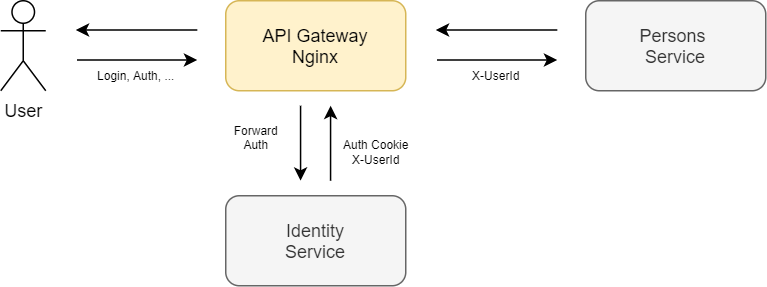

# Nginx Forward Auth

## 1. Описание

В решении для аутентификации используется паттерн **Forward Auth**, где в качестве API GW выступает **Nginx-Ingress**.



* Identity - сервис аутентификации.
* Persons - сервис персональных данных пользователей.

## 2. Установка

```
docker build -t "syyurkin/identity-api:v2" -f "src/Identity.Api/Dockerfile" "src/."
docker build -t "syyurkin/persons-api:v2" -f "src/Persons.Api/Dockerfile" "src/."
```

Необходимо использовать пространство имен `myapp`:

```
kubectl create namespace myapp
kubectl config set-context --current --namespace=myapp
```

Установка сервисов из helm-чартов:

```
helm dependency update "./src/Identity.Api/charts/"
helm dependency update "./src/Persons.Api/charts/"

helm install identity "./src/Identity.Api/charts/"
helm install persons "./src/Persons.Api/charts/"
```

В качестве api-gateway и proxy используется ingress-nginx:

```
helm repo add ingress-nginx https://kubernetes.github.io/ingress-nginx
helm install nginx ingress-nginx/ingress-nginx
```

Установка ingress'ов:

```
kubectl apply -f ./auth-ingress.yaml
kubectl apply -f ./app-ingress.yaml
```

## 3. Тестирование


```
newman run nginx_forward_auth.postman_collection.json
```